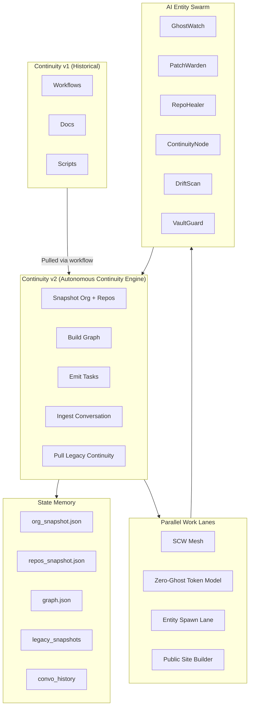

```mermaid
flowchart TD

subgraph Legacy["Continuity v1 (Historical)"]
    L1[Workflows]
    L2[Docs]
    L3[Scripts]
end

subgraph ACE["Continuity v2 (Autonomous Continuity Engine)"]
    S1[Snapshot Org + Repos]
    S2[Build Graph]
    S3[Emit Tasks]
    S4[Ingest Conversation]
    S5[Pull Legacy Continuity]
end

subgraph State["State Memory"]
    ST1[org_snapshot.json]
    ST2[repos_snapshot.json]
    ST3[graph.json]
    ST4[legacy_snapshots]
    ST5[convo_history]
end

subgraph Tasks["Parallel Work Lanes"]
    T1[SCW Mesh]
    T2[Zero-Ghost Token Model]
    T3[Entity Spawn Lane]
    T4[Public Site Builder]
end

subgraph Entities["AI Entity Swarm"]
    E1[GhostWatch]
    E2[PatchWarden]
    E3[RepoHealer]
    E4[ContinuityNode]
    E5[DriftScan]
    E6[VaultGuard]
end

Legacy -->|Pulled via workflow| ACE
ACE --> State
ACE --> Tasks
Tasks --> Entities
Entities --> ACE
```
